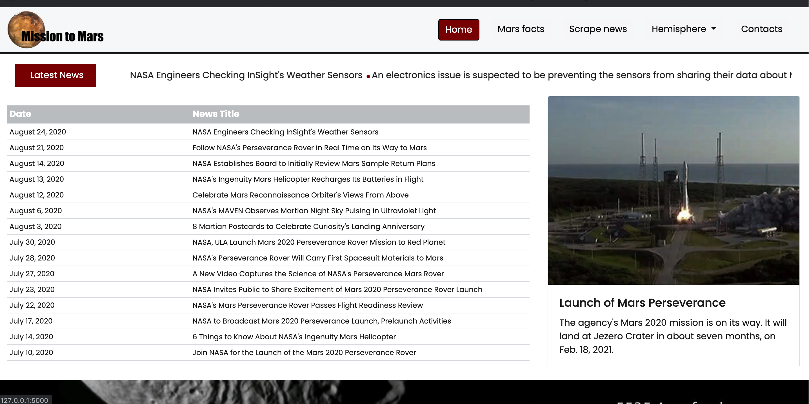
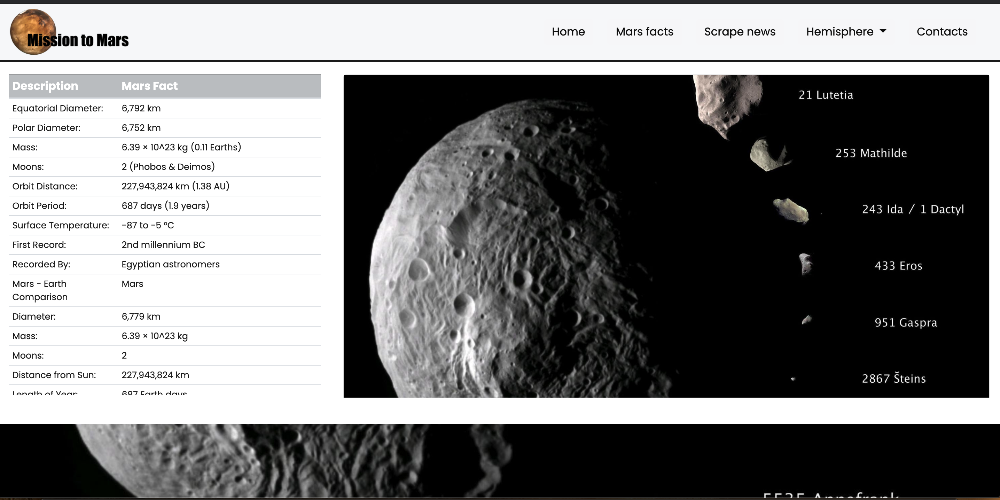
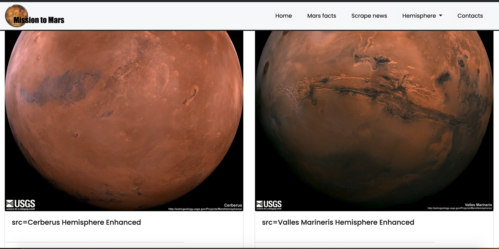
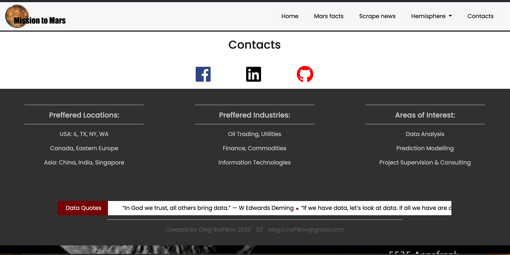

# Mission to Mars (FLASK App)

Data Science and Visualization Boot Camp (Northwestern University)

## Application Setup
* To run the Flask server, I use virtual environment with Python3:
** pipenv shell
** pip install Flask Flask-PyMongo
** python app.py
** Running on http://127.0.0.1:5000/ (Press CTRL+C to quit)

## Home Page

## Mars Facts

## Mars Hemisphere

## Contacts

